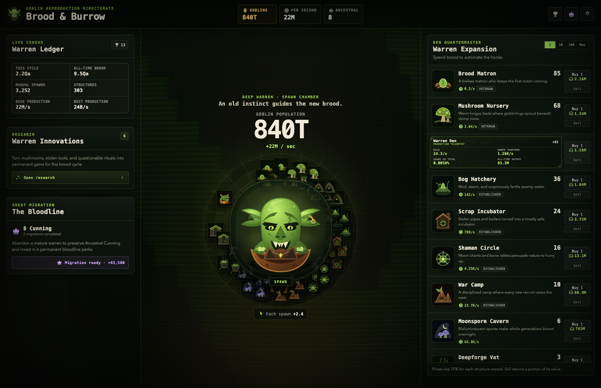
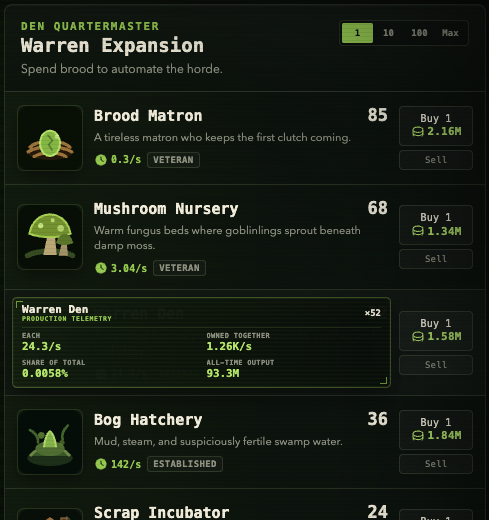
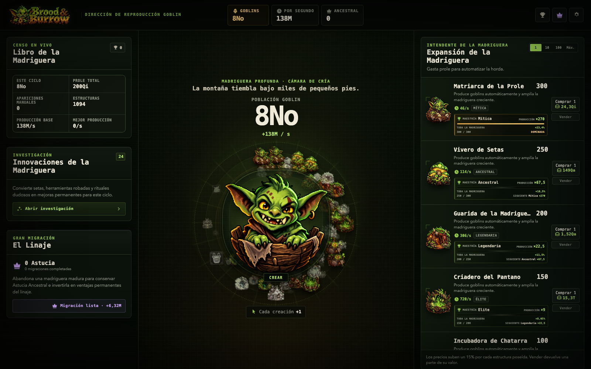
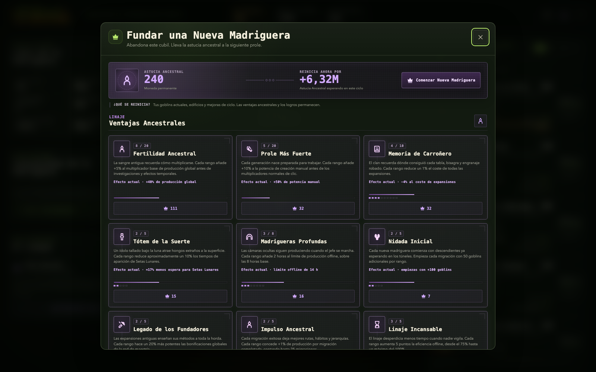
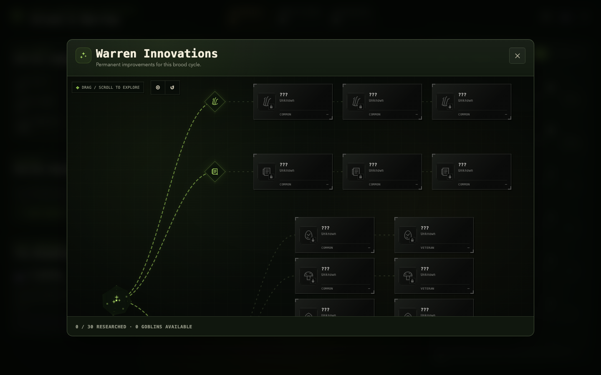
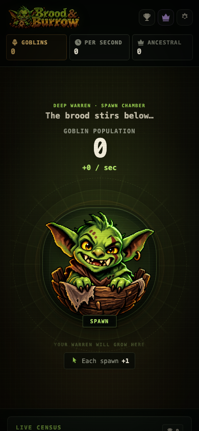

# Brood & Burrow

An original goblin-themed incremental clicker built for the browser. Spawn goblins manually, turn the brood into an automated subterranean industry, unlock upgrades and achievements, catch Mooncap events, and eventually begin a new warren with permanent Ancestral Cunning.

## Screenshots













## Surface expeditions

Build a War Camp to unlock an illustrated, interactive surface map. Choose the Abandoned Mine, Moonlit Ruin, or Merchant Cellar, then combine three crew specialties, three duration bands, and an optional overgrown trail. Each route favors a different warren; mastery shortens the trip.

A single crew reserves 10–23% of production until arrival. Its haul follows the output actually reserved, including production changes and offline efficiency. Recall restores production immediately and forfeits the haul. First returns recover cosmetic keepsakes that survive Great Migration.

The planner previews the tradeoffs before departure, supports keyboard scouting and seven languages, and respects reduced motion. See the [design and balance notes](docs/SURFACE_EXPEDITIONS.md) and the [map generation prompt](docs/SURFACE_MAP_PROMPT.md).

## Tech stack

- React 19 + TypeScript
- Vite 8
- Three.js for the CRTWarp background shader
- Vitest for deterministic game/save/economy tests
- CSS-only responsive UI, effects, and reduced-motion fallbacks

## Run locally

```bash
npm install
npm run dev
```

Release check:

```bash
npm run check
```

The game stores versioned saves in local storage and supports JSON export/import. The complete original project README, architecture notes, and QA checklist are preserved in [`README_ORIGINAL.md`](README_ORIGINAL.md).

Third-party notices are recorded in [`THIRD_PARTY_NOTICES.md`](THIRD_PARTY_NOTICES.md).
