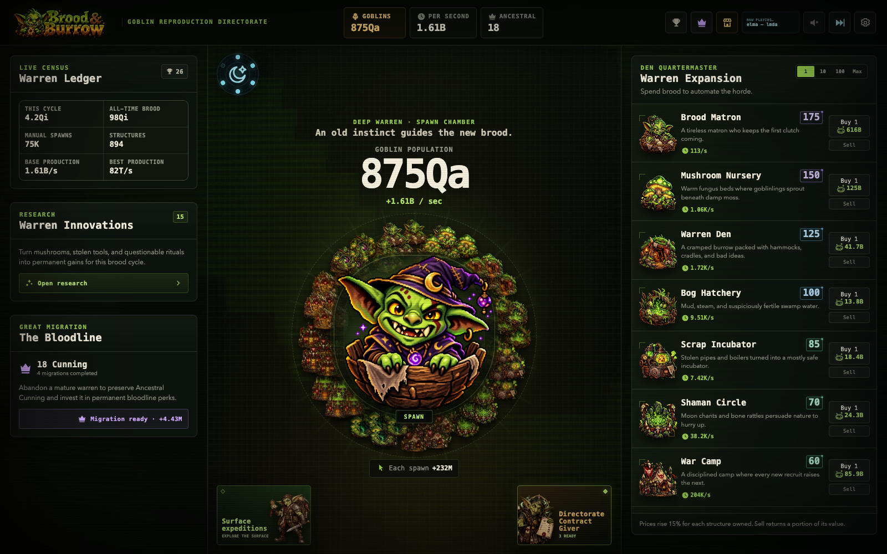
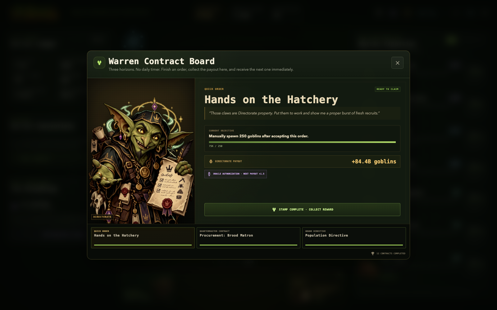
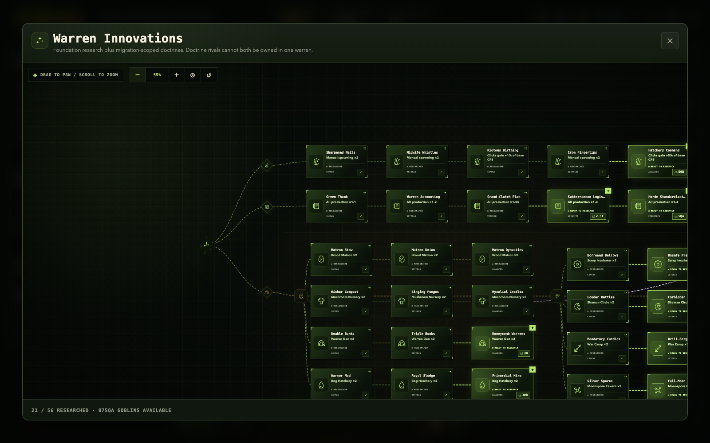
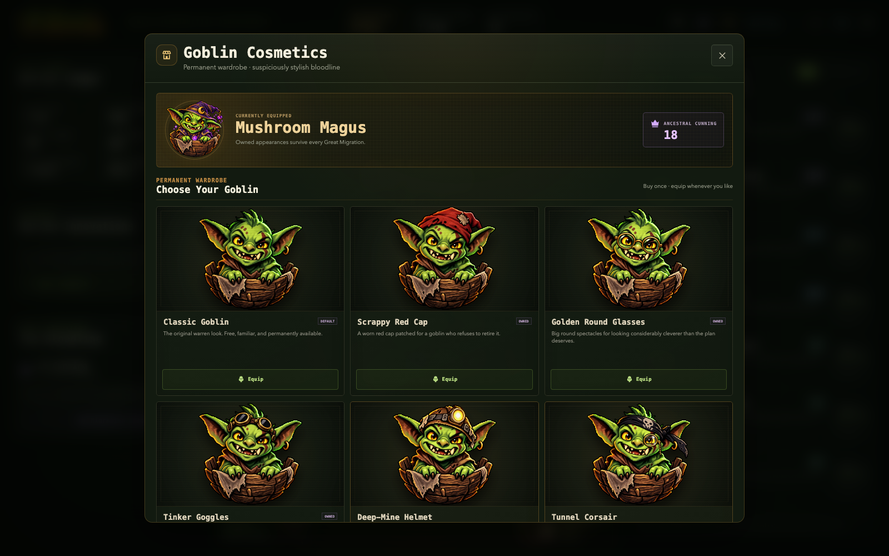

# Brood & Burrow

**Brood & Burrow** is a goblin-themed incremental game built for the browser. Spawn the first goblins by hand, turn a cave into an industrial warren, specialize through research and migration doctrines, chase mastery milestones, send crews to the surface, and carry permanent bloodline upgrades into the next run.

The presentation leans into a dark CRT terminal aesthetic with illustrated goblins, bespoke expansion art, animated effects, ambient music, and a deliberately dense late-game progression layer.

## Screenshots

### Main warren



### Contracts



### Research tree — 55% zoom



### Goblin cosmetics



## Features

| System | What is currently in the game |
| --- | --- |
| **Incremental core** | Manual spawning, passive production, escalating structure costs, bulk purchasing/selling, offline progress, compact number formatting, and persistent statistics. |
| **12 warren expansions** | From the Brood Matron and Mushroom Nursery through Deepforge Vats, Wyrm Hoards, Goblin Gates, and the Reality Burrow. Every expansion has bespoke artwork and production identity. |
| **Expansion mastery** | 8 ownership tiers — Established, Thriving, Veteran, Renowned, Elite, Legendary, Ancestral, and Mythic — with local production multipliers plus an all-warren mastery network bonus. |
| **Research & doctrines** | 56 research nodes: 48 foundation upgrades plus 8 migration-scoped doctrine choices arranged as four mutually exclusive pairs. The tree supports drag-to-pan, wheel zoom, centering, reset, and explicit purchase states. |
| **Great Migration** | Prestige into a new warren for permanent **Ancestral Cunning**, then spend it across 11 ranked bloodline perks affecting production, clicks, costs, offline play, Mooncaps, mastery, and starting resources. |
| **Contracts** | Three simultaneous Directorate contract horizons — Quick Order, Quartermaster Contract, and Grand Directive — with progress tracking, production-scaled rewards, completion effects, and immediately refreshed objectives. |
| **Mooncaps & Moon Dial** | Four event families — Clutchcap, Frenzycap, Bloodcap, and Oraclecap — with distinct rewards/buffs, lunar charge, charge spending, and animated event presentation. |
| **Surface expeditions** | Send a reserved slice of production to one of 3 destinations with 3 crew specialties and 3 duration bands. Expeditions continue through offline progress, can be recalled, and can recover persistent keepsakes. |
| **Goblin cosmetics** | 10 permanent wardrobe unlocks purchased with Ancestral Cunning and carried through Great Migration, with the selected look reflected on the central spawn goblin. |
| **Achievements** | 26 progression deeds covering brood size, clicks, expansion ownership, CPS, Mooncaps, migrations, and broad warren development. |
| **Audio** | An 8-track ambient 16-bit soundtrack with persistent volume, mute, skip, and now-playing controls, plus game sound/effect settings. |
| **Save system** | Versioned local-storage saves, migration/sanitization for older saves, deterministic game state, JSON export/import, and guarded offline simulation. |
| **Localization & UI** | UI support for English, Spanish, Chinese, French, German, Arabic, and Turkish; Arabic uses RTL layout. Includes keyboard-aware modals, focus trapping, reduced-motion support, and responsive layouts. |

## Progression loop

1. **Spawn** goblins manually and buy the first automated expansions.
2. **Scale** the warren through structures, research, mastery thresholds, and production synergies.
3. **React** to Mooncap events, complete Directorate contracts, and dispatch surface expeditions for extra goals and rewards.
4. **Migrate** when the current warren has matured, converting long-run progress into permanent Ancestral Cunning.
5. **Specialize** the next run through permanent perks, cosmetics, and mutually exclusive research doctrines.

The goal is to keep old expansion tiers relevant instead of turning the game into a pure "buy only the newest building" curve. Mastery multipliers, the mastery network, contracts, expeditions, and migration perks all feed back into earlier layers of the economy.

## Tech stack

| Area | Technology |
| --- | --- |
| **UI** | React 19 + React DOM 19 |
| **Language** | TypeScript 6 |
| **Build tooling** | Vite 8 |
| **Graphics** | Three.js 0.180 for the CRT warp/background effect; CSS for the game UI, animation, responsive layout, and reduced-motion fallbacks |
| **Testing** | Vitest 5 with deterministic economy, save, contract, doctrine, expedition, music, and component coverage |
| **Code quality** | ESLint 10 + TypeScript ESLint + React Hooks/Refresh rules |
| **Runtime** | Node.js `>=22.12.0` for local development/build tooling |

The game intentionally keeps its simulation separate from most of the rendering layer. Core economy, save migration, events, contracts, expeditions, and prestige logic live under `src/game/`, while React components consume derived views from `src/App.tsx`.

```text
src/
├── components/   React UI, modals, research tree, expedition map
├── game/         Economy, state, saves, contracts, events, prestige, expeditions
├── i18n/         Language tables and locale-aware formatting
├── images/       Game artwork and expansion/cosmetic assets
├── music/        Ambient soundtrack
├── styles/       Layout, CRT theme, effects, research, expedition and modal CSS
└── utils/        Asset and formatting helpers
```

## Run locally

Requirements: Node.js `>=22.12.0` and npm.

```bash
npm install
npm run dev
```

Vite will print the local development URL in the terminal.

## Validation

Run the complete release check with:

```bash
npm run check
```

Or run individual stages:

```bash
npm run lint
npm test
npm run build
```

## Save data

Brood & Burrow stores its active save in browser local storage. Saves use a versioned schema and are sanitized during load so older supported states can be migrated safely. The Settings screen also provides JSON export/import for portable backups.

## Project notes

- Surface expedition design and balance: [`docs/SURFACE_EXPEDITIONS.md`](docs/SURFACE_EXPEDITIONS.md)
- Surface map generation notes: [`docs/SURFACE_MAP_PROMPT.md`](docs/SURFACE_MAP_PROMPT.md)
- Original long-form project README / QA notes: [`README_ORIGINAL.md`](README_ORIGINAL.md)
- Third-party notices: [`THIRD_PARTY_NOTICES.md`](THIRD_PARTY_NOTICES.md)

This repository currently ships the browser game itself; it does **not** claim native Steam API integration yet.
