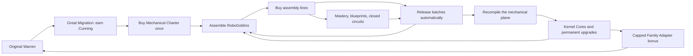

# RoboGoblins: The Unlicensed Future

## 1. Creative premise and player promise

The clan steals a machine capable of assembling one goblin. The machine studies the clan and concludes that the only useful improvement is more goblins. Nobody has the heart—or the correct screwdriver—to stop it.

The player starts with a rattling tin cradle and ends with a factory manufacturing its own ancestors. These are goblins made of stolen cutlery, obsolete electronics, stubbornness and tiny furnace hearts. They remain mischievous individuals: crooked ears, hoarded screws, homemade crowns, a tendency to bite the instruction manual. The factory should look inhabited, not like a sterile robot dashboard.

**Player promise:** build a second civilization, hear its assembly lines fall into rhythm, teach it what to remember, and bring a little of that knowledge home.

Design pillars:

1. **A new place worth revisiting.** A persistent tab, its own wallet, content, statistics and prestige. Both places continue working.
2. **Production has rhythm.** Meaningful batch payouts offer liquidity decisions; waiting produces visible, banked work.
3. **Old junk becomes infrastructure.** Ownership milestones and four-expansion circuits make cheaper lines worth revisiting.
4. **A reset buys a better opening.** Kernel upgrades shorten recovery and open different habits, without requiring endless tapping.
5. **An earned connection home.** Small capped heritage bonuses connect planes without collapsing them into one economy.

Cookie Clicker's developer describes its collect/spend growth loop, varied producers and heavenly permanent upgrades. We borrow that escalation and permanent progression, not its numerical tuning or content. [Official Cookie Clicker description](https://store.steampowered.com/app/1454400/Cookie_Clicker/).

AdVenture Capitalist's developer describes investment diversification, Angel boosts and unattended automation. Its support also distinguishes a planet reset from resetting all destinations. Those are useful precedents for separate progression with clear reset scope; RoboGoblins does not copy planet unlock prices or hard-reset rules. [Official game description](https://store.steampowered.com/app/346900/AdVenture_Capitalist/), [official planet-reset help](https://screenzilla.helpshift.com/hc/en/5-adventure-capitalist/faq/582-how-do-i-reset-a-planet/).

## 2. Exact launch scope

Twelve assembly expansions; eight ownership milestones each; three circuits with four completion tiers; 36 local blueprints; six global blueprints; two firmware pairs (four choices); Overclock; Recompile; eight ranked Kernel upgrades; twelve achievements; three earned robot appearances; two bounded heritage bridges; a second tab; full save/offline/localization support.

There is no recurring robot contract board, random disaster, upkeep debt, multiplayer market or third spendable currency in this release. Keep attention focused on building, batch timing, circuit completion and reset decisions. Later ideas are listed at the end and are not required to finish this chapter.

## 3. Entry after discovering the full Warren

The mirrored top-right RoboGoblins control is the only purchase entry point. Before the frontier is discovered it is subdued and explains that every default Warren building must first be revealed. Once the player has revealed the complete twelve-building roster, permanently latch RoboGoblins purchase eligibility. A later Great Migration may reset current building ownership, but it must never remove that eligibility.

Clicking the eligible top-right control opens a compact purchase popup:

> **Mechanical Charter** — 100 Ancestral Cunning
> Open the RoboGoblins foundry. Your Warren continues producing in parallel.
> Requires every default Warren building to have been discovered at least once.

There is no migration-count or lifetime-earned-Cunning requirement. At purchase time the only remaining economic check is `shards >= 100`. On success, subtract 100 from the current wallet, preserve total earned Cunning, create mechanical state once and persist immediately. Keep **Enter RoboGoblins** as the next explicit action rather than forcing navigation.

The purchase is a permanent entitlement, not a rank, migration or reset. No organic resources or buildings are consumed except the stated Cunning price. Repeated clicks return a no-op after success. No further entrance fee. Switching tabs never resets, pauses or converts anything.

The building-roster gate makes the frontier a direct reward for seeing the complete default expansion rather than for hitting an abstract prestige counter. Hover/focus text and the purchase popup should state both the requirement and that eligibility survives future resets.

## 4. Currencies and accounting language

| Display | Meaning | Earned by | Spent on | Reset behavior |
| --- | --- | --- | --- | --- |
| **RoboGoblins**, RG | Completed robots available for assignment | Manual assembly and released factory batches | Assembly expansions, blueprints and firmware | Replaced by starter stock on Recompile |
| **Kernel Cores** | Preserved machine learning | Recompile against cumulative mechanical production | Permanent Kernel upgrades | Wallet and earned total persist |
| **Charge**, 0–120 | Bounded capacitor meter, not currency | One point/s with at least one line; no refill during Overclock | One Overclock costs all 120 | Clears on Recompile, then Warm Start applies |

The robots themselves are the new currency. Buying a line assigns ready robots to construct and staff it, just as the original game uses goblins to grow the Warren. Do not also introduce scrap, coins and worker upkeep. Spawning visibly produces RoboGoblins; it never silently pays organic goblins.

Use **Ready RoboGoblins** for spendable stock, **Average assembly /s** for production, and **In assembly** for produced but unreleased batches. Lifetime RG counts completed deliveries and manual spawns; Recompile first settles already manufactured work. Starter grants and spent resources never inflate lifetime. Fractional RG are valid simulation quantities, as in the existing game; display compact rounded values but retain precision.

## 5. Loops and pacing



| Horizon | Player decision | Reward |
| --- | --- | --- |
| Seconds | Assemble manually; see a batch land | Immediate feedback and spendable RG |
| 1–5 minutes | Next line, local milestone or blueprint; optional Overclock | A clear production jump |
| 5–15 minutes | Close a circuit; choose firmware | Breadth bonus and a preferred play style |
| Roughly 20–60 minutes in the model | Push for more cores or Recompile | Permanent learning and faster recovery |
| Several sessions | Reach the final factories, build all circuits, complete the Kernel | A second civilization and useful ties to the Warren |

These horizons are design targets. The generated report distinguishes measured laboratory times from untested player behavior. Recompile becomes available at one core; the tutorial suggests reviewing the shop at four and considering the first reset around eight. It is advice, not a forced reset, timer or button lock.

### First visit

1. A short optional introduction: “The machine has learned one thing: make more goblins.”
2. Start with **20 RG**, exactly enough for one Tin Cradle. Explain the first buy with an anchored, dismissible hint.
3. The Tin Cradle automatically releases its first one-RG batch after two seconds. All lines are automated from purchase; do not require buying managers just to resume idling.
4. The central **Assemble** control remains available. At zero factories it makes one RG. A brief first-use animation seats a glowing heart in a tin goblin.
5. Reveal the circuit panel when any expansion reaches ten. Reveal firmware at one million produced this run and Recompile details at one claimable core. Overclock is visible from the first line, charging from zero.
6. Next-goal guidance uses one compact objective: the nearest local milestone, next affordable blueprint, or recommended core budget. It never hides other purchases.

## 6. Assembly expansions

Numbers are authoritative in `balance-model.mjs`. Base price growth is **1.14 per owned unit**, shared by all mechanical lines. There are no mechanical purchase discounts in v1.

| Circuit | Expansion / stable ID | Base cost RG | Average RG/s | Batch s | Identity |
| --- | --- | ---: | ---: | ---: | --- |
| Scrap | Tin Cradle / `tin_cradle` | 20 | .5 | 2 | A soup tin with rocking feet and one proud parent |
| Scrap | Wind-up Workbench / `windup_workbench` | 160 | 4 | 4 | Tiny robots winding each other with stolen keys |
| Scrap | Cutlery Press / `cutlery_press` | 2,000 | 32 | 8 | Household silverware stamped into sharp little bodies |
| Scrap | Magnet Nursery / `magnet_nursery` | 26,000 | 240 | 16 | Magnets fishing newborns out of a scrap pond |
| Steam | Boiler Brood / `boiler_brood` | 350,000 | 1,800 | 8 | A furnace mother with a clutch of pressure vessels |
| Steam | Punchcard Den / `punchcard_den` | 5,000,000 | 13,000 | 16 | Machines taught mischief by chewed punchcards |
| Steam | Servo Scriptorium / `servo_scriptorium` | 80,000,000 | 95,000 | 32 | Robot scribes copying plans faster than they can read |
| Steam | Walking Foundry / `walking_foundry` | 1,400,000,000 | 700,000 | 64 | An entire factory on bent chicken legs |
| Impossible | Thunderhead Coil / `thunderhead_coil` | 28,000,000,000 | 5,200,000 | 16 | A bottled storm issuing birth certificates |
| Impossible | Moonwire Loom / `moonwire_loom` | 600,000,000,000 | 40,000,000 | 32 | Moonlight woven into metal skeletons |
| Impossible | Clockwyrm Assembly / `clockwyrm_assembly` | 14,000,000,000,000 | 320,000,000 | 64 | A dragon made of gears, coughing up assembly lines |
| Impossible | Paradox Nest / `paradox_nest` | 350,000,000,000,000 | 2,600,000,000 | 64 | Future robots assembling their own ancestors |

The first line is visible immediately. Owning any of a line reveals the next; reveal persists within the run because v1 has no selling. A player cannot skip an unrevealed predecessor using a forged purchase action. Locked rows show a silhouette, name and requirement; only the next locked row needs full art and copy.

Purchase controls: 1, 10, 100, Max, plus **Next milestone** per row. Show actual quantity and total cost; Max must be recomputed when clicked. Mechanical lines cannot be sold in v1: assignment is permanent for the current compile. Label this in the shop help. Bulk rounding follows the existing geometric-sum convention.

### Real batches, not a decorative progress bar

Each line type has one shared assembly phase and one pending-output ledger, irrespective of owned count. Its first purchase starts at phase zero. More units increase the future accrual rate; they do not multiply work already done or reset the phase. Each cycle automatically transfers pending RG to ready stock; no claim click or inventory cap. Different line types start at different times and are not forcibly synchronized.

The displayed RG/s is an average, so it may not match the instantaneous wallet movement. Show “Next batch in 5s · 320 already assembled” on an expanded row, with forecasted batch output clearly labeled as an estimate. All produced value is integrated at the rate applying during each portion of the cycle. Buying research just before payout cannot boost earlier work retroactively.

## 7. Ownership and circuits

Each achieved ownership milestone multiplies local output cumulatively:

| Owned | Title | New factor | Cumulative local factor |
| ---: | --- | ---: | ---: |
| 10 | Bolted | ×2 | ×2 |
| 25 | Calibrated | ×2 | ×4 |
| 50 | Synchronized | ×3 | ×12 |
| 100 | Self-tooling | ×4 | ×48 |
| 150 | Replicating | ×2 | ×96 |
| 200 | Distributed | ×3 | ×288 |
| 250 | Recursive | ×3 | ×864 |
| 300 | Unreasonably Alive | ×4 | ×3,456 |

There is no imported organic veterancy factor. Instead, the **Scrap**, **Steam** and **Impossible** circuits each connect the four expansions assigned in the table. At a minimum ownership of 10, 25, 50 and 100 across all four members, a circuit contributes another **+10 percentage points to a shared mechanical production bonus**. Twelve possible tiers give `1 + .1 × 12 = ×2.2` maximum before Kernel perks.

A high-level factory benefits when a cheap old circuit closes. The panel names the bottleneck: “Scrap circuit: Tin Cradle 9/10; the other three lines are ready. Next tier: +10% of the shared base factor.” The button buys only the needed units in the selected bottleneck; no hidden multi-line bundle.

Circuits are economic groupings, not a placement puzzle. Their wires visually connect the expansion art; players do not lose output because they cannot draw a circuit on a phone. The tier name “Synchronized” is descriptive: it does not align payout timers.

## 8. Run upgrades and firmware

### Local blueprints: 36 defined purchases

Each line has the following sequential blueprints, with stable ID `<lineId>_<tierId>`. A later blueprint requires all previous blueprints for that line as well as its ownership threshold. It affects only that line's future assembly rate.

| Tier ID / displayed title template | Ownership | Cost | Effect |
| --- | ---: | ---: | --- |
| `stolen_plans` / “{Line}: Stolen Plans” | 10 | 25 × base line cost | ×2 local output |
| `self_inspection` / “{Line}: Self-inspection” | 50 | 500 × base line cost | Another ×2 |
| `recursive_tooling` / “{Line}: Recursive Tooling” | 100 | 20,000 × base line cost | Another ×2 |

Flavor text can differ per line; the numerical behavior cannot. For example, Tin Cradle blueprints cost 500 / 10,000 / 400,000 RG; their combined factor is ×8. At 100 Tin Cradles with all three, local mastery and blueprints combine to ×384 before shared factors.

### Global blueprints: six sequential purchases

| ID | Name | Cost RG | Output factor |
| --- | --- | ---: | ---: |
| `common_thread` | Common Thread | 2,000 | ×1.25 |
| `standard_sockets` | Standard Sockets | 200,000 | ×1.25 |
| `distributed_mischief` | Distributed Mischief | 20,000,000 | ×1.5 |
| `factory_remembers` | The Factory Remembers | 2,000,000,000 | ×1.5 |
| `illegal_recursion` | Illegal Recursion | 200,000,000,000 | ×1.75 |
| `birth_without_permission` | Birth Without Permission | 20,000,000,000,000 | ×2 |

They unlock sequentially after buying any first line, have no additional ownership gate, and multiply together. Use a compact blueprint catalog with “Available”, “All” and circuit filters. A second large draggable tree is unnecessary for this regular structure.

### Firmware pair 1: control logic

Unlocked at one million genuinely produced RG **this compile**, each costs 500,000 RG. Buy one per compile; the other becomes unavailable until Recompile.

- **Clockwork Consensus**, `clock`: ×1.20 passive output. “Agree on a schedule. Ignore all complaints.”
- **Spark Personality**, `spark`: manual spawning uses 15% instead of 3% of stable pre-control-logic RG/s. “Every button deserves to be pressed.”

Baseline manual power is `1 + .03 × P`, where P excludes Overclock and the Clockwork multiplier but includes other permanent/run production factors. Finger Servos multiplies the whole click amount. Keyboard activation and pointer activation share one engine action; key repeat is allowed like repeated clicks, with no separate multiplier. There is no model-imposed input cap.

Spark overtakes Clockwork around 1.67 clicks/s at rank-zero Finger Servos without Overclock. At perfectly used Overclock the static crossover becomes two clicks/s. The design favors Clockwork for idle play and makes Spark a deliberate active choice; it does not demand thousands of taps to progress.

### Firmware pair 2: dispatch cadence

Unlocked at one billion genuinely produced RG this compile, each costs 500 million RG. Independent of pair 1; four valid combined builds.

- **Quick-release Latches**, `quick`: all batch intervals ×0.5, same average output.
- **Heavy Batch Protocol**, `heavy`: intervals ×2, average output ×1.15.

When purchasing either option, settle all already manufactured pending work once and restart phases at zero under the new intervals. This happens only once per compile, cannot be toggled, and creates no extra output. Quick buys earlier liquidity; Heavy buys long-run output. Even the longest Heavy interval is 128 seconds. Show the new interval and rate before committing, and explain the lock until Recompile.

## 9. Overclock

With at least one purchased line, gain one Charge per elapsed second, to 120. Charge also fills while viewing the other game tab and during credited offline time. Manual taps do not charge it.

**Overclock** spends 120 Charge and doubles future passive assembly accrual for 30 seconds. Charge does not refill during that effect. There is no damage, failure roll, negative output or permanent penalty. The effect never amplifies manual power, cross-plane output, or already accumulated pending RG. Batches release on their normal schedule; show the extra pending output even if the wallet has not moved yet.

Its theoretical constant-production ceiling is +20% average passive output with perfect repeat activation. An unattended Overclock is not auto-triggered. Offline progress ends any temporary effect as the original game's offline design does. Warm Start can supply beginning charge; no upgrade extends duration or increases its multiplier in v1.

## 10. Recompile and Kernel Cores

Recompile is the mechanical plane's prestige, accessible from its own **Kernel** panel. It can be used whenever at least one new core is earned. It never invokes Great Migration.

```text
eligible lifetime = delivered lifetime RG + all accrued pending RG
potential cores = floor(cuberoot(eligible lifetime / 10,000,000))
new cores = max(0, potential cores - total cores previously earned)
innate mechanical output factor = 1 + .10 × total cores earned
```

Cap potential/earned cores at one billion to keep integer wallet arithmetic safe beyond the intended horizon. Implement a threshold-corrected cube root, not an unconditional epsilon that could unlock early. Spending cores never lowers `totalCoresEarned` or its innate bonus. Unclaimed potential does not grant the bonus.

Reference budgets: 1 core at 10M lifetime RG; 4 at 640M; 8 at 5.12B; 16 at 40.96B; 32 at 327.68B. After claiming eight, the next eight require reaching the cumulative sixteen-core threshold, not earning 5.12B again.

Recompile previews the **actual gain**, current → new innate multiplier, selected wishlist affordability and the concrete reset inventory. Settle pending batches in the preview and actual action identically. On confirm, use one atomic engine transition: advance both planes to now, settle mechanical pending value, calculate gain, and reset only mechanical run fields. A failed zero-gain action has no reset/drain side effects.

| Item | Charter purchase | Switch tab | Great Migration | Recompile |
| --- | --- | --- | --- | --- |
| Organic wallet, expansions, research | Preserved | Continue | Existing reset rules | Preserved |
| Cunning balance | −100 once | Preserved | Earn gain | Preserved |
| Organic achievements/perks/cosmetics | Preserved | Preserved | Preserved | Preserved |
| Mechanical entitlement | Create once | Preserved | Preserved | Preserved |
| Mechanical stock/expansions/blueprints/firmware | Initialize | Continue | Preserved | Reset |
| Mechanical phases/pending | Initialize | Continue | Continue | Settle then clear |
| Charge/Overclock | Zero | Continue | Continue | Clear; apply Warm Start |
| Kernel wallet, earned total, perks | Initialize | Preserved | Preserved | Add gain; preserve |
| Mechanical lifetime and achievements/looks | Initialize | Preserved | Preserved | Preserve |

Full **Erase save** remains a separate existing settings action that deletes both planes after its existing confirmation. Export/import includes both. Great Migration may improve the heritage bridge after earning Cunning, but never recompiles robots.

### Kernel shop: eight permanent tracks

Prices: `ceil(base × 2^currentRank)`. Buy while in the Kernel panel; no between-runs-only limbo. All effects are mechanical except the explicitly named Family Adapter.

| ID / name | Base cores | Max rank | Exact effect |
| --- | ---: | ---: | --- |
| `better_bolts` / Better Bolts | 1 | 10 | Mechanical passive factor `1 + .05r` |
| `boot_cache` / Boot Cache | 2 | 5 | +100 ready RG immediately per newly purchased rank, and starting stock `20 + 100r` on later Recompiles; these are grants, not production |
| `night_shift` / Night Shift | 2 | 4 | Offline efficiency `min(1, .8 + .05r)` |
| `deep_battery` / Deep Battery | 3 | 8 | Offline cap `8 + 2r` hours |
| `copper_memory` / Copper Memory | 3 | 5 | Each completed circuit tier adds `.10 + .01r` to the shared production factor |
| `warm_start` / Warm Start | 4 | 4 | Grant +30 charge per new rank immediately, capped at 120; start later Recompiles with `30r` charge |
| `finger_servos` / Finger Servos | 2 | 5 | Manual output factor `1 + .10r` |
| `family_adapter` / Family Adapter | 5 | 5 | Organic passive bridge described below |

Boot Cache and Warm Start immediate grants occur once on successful rank purchase, never when loading the shop, switching tabs or deserializing. They do not generate cores by themselves. Better Bolts, Finger Servos and other effects apply prospectively after advancing time; no retroactive pending-work amplification.

Suggested first-eight-core plan: Better Bolts rank 1 (1), rank 2 (2), Boot Cache rank 1 (2), keep 3. The lab reaches eight additional cores in 17m 22s versus 27m 15s on the opening run. A less active player can choose Night Shift and Deep Battery instead. The recommendation must be a dismissible hint, not an automatic purchase.

## 11. Modest bridges between worlds

**Inherited Blueprints** is automatic after unlocking. At earned-Cunning milestones 2,500 / 10,000 / 100,000 / 1,000,000 / 10,000,000, gain +2 percentage points of a mechanical passive factor. Thus `heritageToRobo = 1 + .02 × reachedMilestones`, capped at ×1.10. The entry bonus is ×1.02. It survives spending Cunning and resets. Do not apply individual organic perks, temporary Mooncaps, doctrine multipliers or expedition effects to mechanical output.

**Family Adapter** is purchased with cores. For each earned-core milestone 8 / 32 / 128 / 512 / 2,048, add +1 percentage point of an organic passive factor **per Adapter rank**. Thus `heritageToWarren = 1 + .01 × adapterRank × reachedMilestones`, capped at ×1.25. It applies as one extra factor in organic base CPS. Existing organic click scaling, contracts and expedition math naturally benefit when they read that base; do not multiply their rewards a second time.

Both bridges use claimed lifetime prestige totals, not current wallets, current CPS or one world's currency converted into the other. They are capped monotonic bonuses, so no instant circular calculation is needed. There is some long-term positive feedback from faster production to prestige; its bridge contribution is bounded. The robots remain useful even when the player returns to a late organic Warren, and an advanced organic save cannot buy through the entire robot chapter.

## 12. Collection and long-term direction

Achievements award a timestamp, a toast and collection progress. They do not multiply output. All checks run against engine state and persist through both prestiges.

| ID | Title | Condition |
| --- | --- | --- |
| `rg_first_spark` | It Has Opinions | One manual RG assembly action |
| `rg_unattended` | Somebody Else's Problem | Own one Tin Cradle |
| `rg_bolted` | Tighten Until It Complains | Any line reaches ten |
| `rg_scrap_circuit` | A Complete Bad Idea | Scrap circuit reaches its first tier |
| `rg_first_million` | A Million Loose Screws | 1M delivered lifetime RG |
| `rg_overclock` | Smoke Is a Feature | Activate Overclock once |
| `rg_firmware` | The Machine Disagrees | Choose either control-logic firmware |
| `rg_recompile` | Remember the Important Bits | Complete one Recompile |
| `rg_steam_circuit` | Union of Boilers | Steam circuit reaches its first tier |
| `rg_three_circuits` | Everything Is Connected | All three circuits reach their first tier in the same compile |
| `rg_paradox` | Your Grandchild Built You | Own one Paradox Nest |
| `rg_kernel_complete` | A Very Small God | All eight Kernel tracks reach maximum rank |

Earned robot appearances: **Tin Rascal** is the default; **Boiler Baron** unlocks with `rg_steam_circuit`; **Clockwork Ancestor** unlocks with `rg_paradox`. Choose freely once earned. These are mechanical looks, not replacements for the organic Cunning wardrobe, and have no stats. Add two unlock notifications, not an extra paid shop.

The chapter's first narrative payoff is the Paradox Nest reveal: “The first robot waves from inside the last machine.” Keep playing for later mastery, all circuits, the complete Kernel and the original game's continued growth. No forced ending or automatic reset when all content is owned.

## 13. Offline, attention and humane pacing

Both **in-game tabs** run at full online production while the app document is visible. Switching views changes attention only. Do not gate RoboGoblins behind keeping its animation mounted. The inactive plane shows a passive summary on its tab; only persistent states such as a claimable prestige produce a small badge. Never jump the player to an event.

When the browser document becomes hidden, save one advanced state and suspend foreground advancement. On return, apply each plane's offline policy once from the saved shared timestamp. Both have separate efficiency/cap settings; no shared eight-hour budget. Robot base is 80% for eight hours, rising to 100% for 24 through its own perks. Original Warren retains its existing 75%/eight-hour baseline and own perks.

No auto-buying, auto-Recompile, auto-Overclock or scripted manual taps while offline. Batch release is automatic. Any work still pending on return remains pending; it is displayed rather than discarded. Time beyond the offline cap creates no work and does not complete a pending batch. Charge refills only over credited time and to its cap. Root time still advances to return time, so excess hours cannot be reclaimed.

There are no login streaks, limited daily windows or punishment for missed events. One optional click burst should help start a run; idle players get a free first producer's exact price and can progress without clicking. The design test suite's steady-tapping scenario is an upper-attention comparison, not the target behavior.

## 14. Future ideas — explicitly outside launch

- **Salvage postcards:** nonexpiring schematic discoveries from mechanical destinations; design their resource conservation before adding rewards.
- **Socket personalities:** collectible nonconsumable firmware modules with a small number of sockets; requires dominance tests and a clear swap rule.
- **The Factory That Stole the Moon:** a later plane unlocked by a completed Kernel, with its own local reset. Do not reserve a speculative third currency now.
- **Warren museum:** paired exhibits from both civilizations; cosmetic account goals that survive everything except erase-save.
- **Self-assembling districts:** an optional automation layer for already-mastered opening purchases. Must preserve spending limits and avoid automatic prestige.

Do not add these while the launch loop, compatibility and pacing remain unverified.
